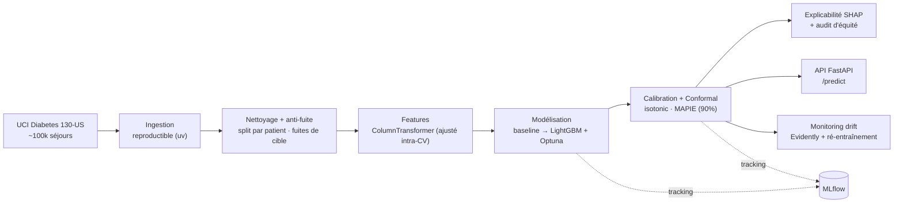
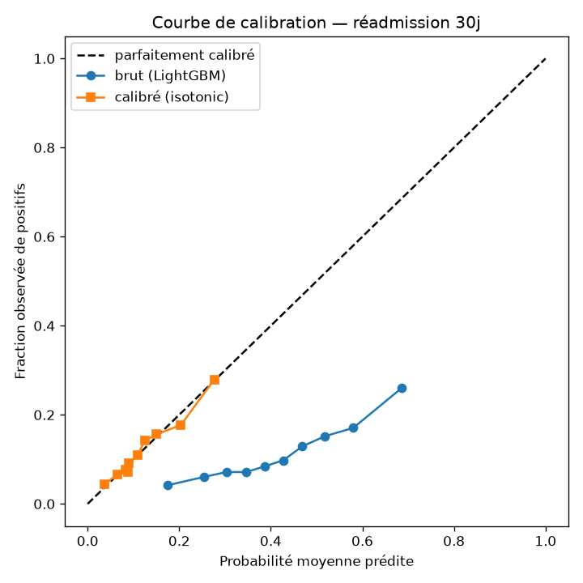
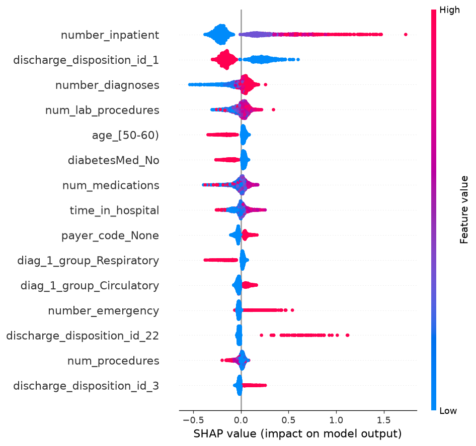
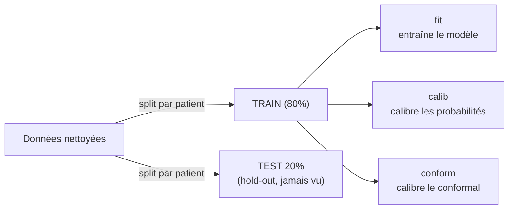

<div align="center">

# Readmission Risk — Prédiction de réadmission hospitalière à 30 jours

**Un pipeline Machine Learning de bout en bout, pensé pour la production :**
de la donnée hospitalière brute et imparfaite à une API de scoring **calibrée, explicable et surveillée**.

[](https://github.com/behramkorkut/readmission-risk-ml/actions/workflows/ci.yml)


</div>

---

## Enjeu

Les réadmissions précoces sont coûteuses, souvent évitables et pénalisées financièrement.
Un modèle utile doit être **honnête** (aucune fuite de données) et **digne de confiance**
(calibré, accompagné d'une incertitude, explicable, auditable et surveillé en production).
Ce projet construit exactement cela, étape par étape.

**Données** : *Diabetes 130-US hospitals (1999-2008)* — ~101 766 séjours, 50 variables (UCI),
choisi pour son réalisme (valeurs manquantes, codes ICD-9, plusieurs séjours par patient,
fuites de cible à neutraliser).

##  Architecture



## Résultats clés (test hold-out, patient-disjoint)

| Métrique | Baseline (régression log.) | **LightGBM tuné + calibré** |
|----------|:--------------------------:|:---------------------------:|
| **PR-AUC** (primaire ; base 0,114) | 0,215 | **0,231** |
| **ROC-AUC** | 0,664 | **0,675** |
| **Brier** (qualité de calibration) | 0,225 | **0,097** |
| **Couverture conformelle** (cible 90 %) | — | **~0,90** |

<p align="center">
  
  &nbsp;&nbsp;
  
</p>
<p align="center"><em>À gauche : calibration des probabilités (la courbe calibrée colle à la diagonale).
À droite : explicabilité SHAP — <code>number_inpatient</code> (hospitalisations antérieures) domine.</em></p>

**Confiance & transparence** : probabilités **calibrées** (Brier divisé par ~2), **incertitude
garantie** par conformal prediction (un ensemble `{réadmission}` confiant vs `{non, réadmission}`
= « je ne tranche pas »), **explications SHAP** par prédiction, et **audit d'équité** par
sous-groupes (équitable selon le sexe ; dégradation documentée sur les patients très âgés).
Détails, performances et **limites** dans la [**Model Card**](MODEL_CARD.md).

## Rigueur : la validation anti-fuite

Le point qui rend les scores **honnêtes**. Le `TRAIN` est découpé en jeux **patient-disjoints**
(un même patient n'est jamais des deux côtés), et le `TEST` reste intact jusqu'à l'évaluation finale.



Triple garde-fou : **(1)** split groupé par `patient_nbr` (StratifiedGroupKFold), **(2)** retrait
des séjours à cible mécaniquement déterminée (décès / soins palliatifs), **(3)** préprocesseur
ajusté **dans chaque fold** de validation croisée.

## Stack technique

| Domaine | Outils |
|---------|--------|
| Données / features | pandas, numpy, scikit-learn, pyarrow, **Pandera** (contrats de données) |
| Modélisation | **LightGBM**, **Optuna** (recherche bayésienne) |
| Confiance | calibration (isotonic/Platt), **conformal prediction** (MAPIE) |
| Explicabilité / équité | **SHAP**, audit par sous-groupes, model card |
| MLOps | **MLflow**, **Evidently** (drift), **FastAPI**, **Docker**, CI **GitHub Actions**, pytest, ruff |
| Gestion de projet | **uv** |

## Installation & pipeline complet

```bash
uv sync --group dev
cp .env.example .env

uv run readmission-ingest         # 1. télécharge le dataset (UCI) -> data/
uv run readmission-clean          # 2. nettoyage + anti-fuite
uv run readmission-train-baseline # 3. baseline (régression logistique) + MLflow
uv run readmission-train-gboost   # 4. LightGBM tuné par Optuna + MLflow
uv run readmission-calibrate      # 5. calibration + conformal -> models/model.joblib
uv run readmission-explain        # 6. SHAP + audit d'équité -> reports/
uv run readmission-drift          # 7. monitoring de dérive -> reports/drift_report.html
uv run readmission-serve          # 8. API de scoring -> http://localhost:8000/docs
```

Suivi des expériences : `uv run mlflow ui --backend-store-uri sqlite:///mlflow.db`

### Exemple d'appel à l'API

```bash
curl -X POST http://localhost:8000/predict -H "Content-Type: application/json" \
  -d '{"features":{"age":"[70-80)","number_inpatient":3,"number_diagnoses":9}}'
```
```json
{
  "risk": 0.10,
  "prediction_set": ["non_readmis"],
  "confidence_level": 0.9,
  "calibration_method": "isotonic",
  "top_reasons": [{"feature": "number_inpatient", "contribution": 0.60, "direction": "augmente"}]
}
```

##  Docker

```bash
uv run readmission-calibrate          # génère le modèle embarqué dans l'image
docker build -t readmission-api .
docker run -p 8000:8000 readmission-api
```

## Qualité

```bash
uv run ruff check .       # lint
uv run pytest -q          # 29 tests (validés aussi en CI à chaque push)
```

Tests couvrant l'anti-fuite (split par patient), le contrat de données (Pandera), le nettoyage,
le pipeline de features, la validation croisée, le tuning, la calibration/conformal, l'API et le drift.

##  Structure

```
readmission-risk-ml/
├── src/readmission_risk/
│   ├── common/      # config (graine, chemins, MLflow)
│   ├── data/        # ingestion, nettoyage/anti-fuite, split par patient
│   ├── validation/  # schéma Pandera (contrat de données)
│   ├── features/    # ColumnTransformer (imputation, OHE, anti-fuite intra-CV)
│   ├── modeling/    # CV groupée, baseline, LightGBM+Optuna, calibration+conformal
│   ├── evaluation/  # SHAP + audit d'équité
│   ├── serving/     # API FastAPI
│   └── monitoring/  # drift (Evidently) + injection de dérive
├── tests/           # tests pytest
├── reports/         # graphiques (calibration, SHAP) + rapport de drift interactif
├── MODEL_CARD.md    # usage, performances, équité, limites
└── journal/         # journal de bord détaillé (démarche pas à pas)
```

---

<div align="center">
<sub>Projet portfolio Data Science / ML — validation rigoureuse, confiance (calibration + conformal),
explicabilité, équité et MLOps. Voir aussi la <a href="MODEL_CARD.md">Model Card</a>.</sub>
</div>
