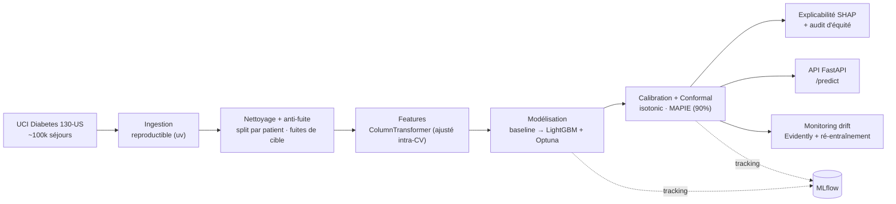
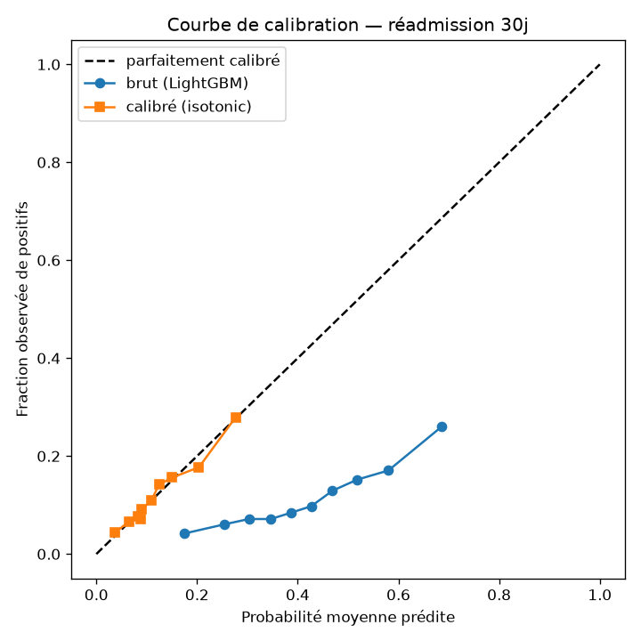
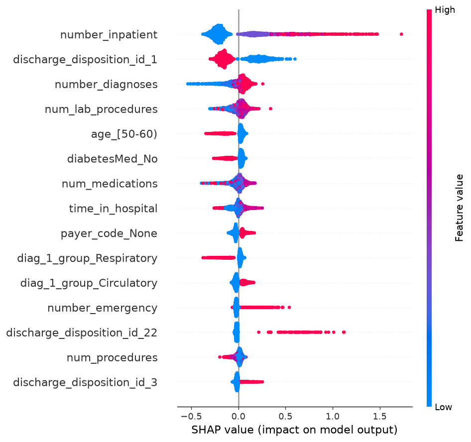
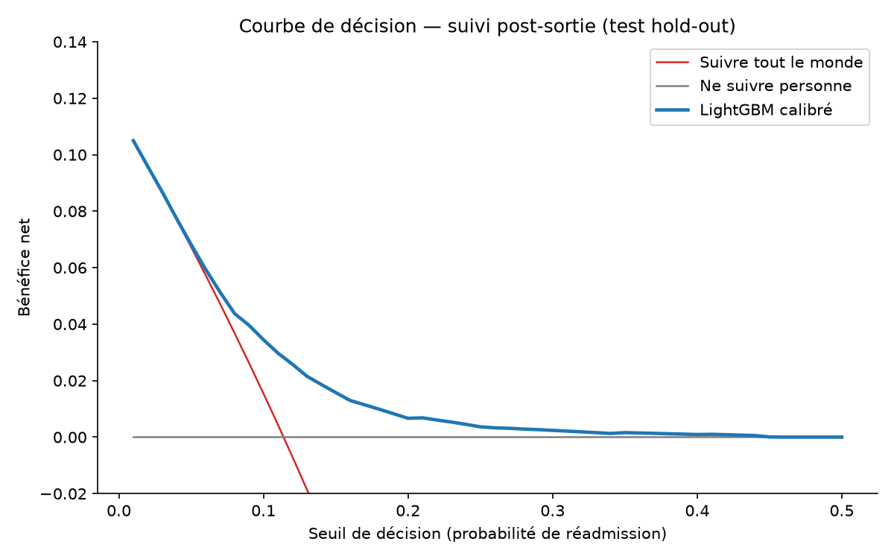
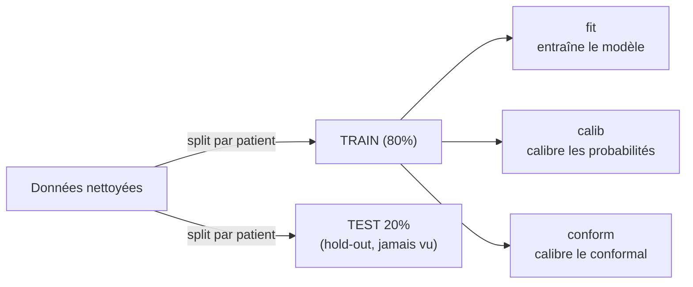

<div align="center">

# Readmission Risk :  Prédiction de réadmission hospitalière à 30 jours

**Un pipeline Machine Learning de bout en bout, pensé pour la production :**
de la donnée hospitalière brute et imparfaite à une API de scoring **calibrée, explicable et surveillée**.

[](https://readmission-risk-ml-hc8jagedod6ufuknz2yjqt.streamlit.app/)
[](https://api-readmission.wisty.fr/docs)
[](https://github.com/behramkorkut/readmission-risk-ml/actions/workflows/ci.yml)


</div>

---

## Enjeu

Les réadmissions précoces sont coûteuses, souvent évitables et pénalisées financièrement.
Un modèle utile doit être **honnête** (aucune fuite de données) et **digne de confiance**
(calibré, accompagné d'une incertitude, explicable, auditable et surveillé en production).
Ce projet construit exactement cela, étape par étape.

> ▶ **[Essayer la démo interactive](https://readmission-risk-ml-hc8jagedod6ufuknz2yjqt.streamlit.app/)** — risque calibré, ensemble de prédiction
> conformel et explications SHAP sur un dossier patient que vous composez (profils pré-remplis inclus).

**Données** : *Diabetes 130-US hospitals (1999-2008)* — ~101 766 séjours, 50 variables (UCI),
choisi pour son réalisme (valeurs manquantes, codes ICD-9, plusieurs séjours par patient,
fuites de cible à neutraliser).

##  Architecture


```mermaid
flowchart LR
    A["UCI Diabetes 130-US<br/>~100k séjours"] --> B["Ingestion<br/>reproductible (uv)"]
    B --> C["Nettoyage + anti-fuite<br/>split par patient · fuites de cible"]
    C --> D["Features<br/>ColumnTransformer (ajusté intra-CV)"]
    D --> E["Modélisation<br/>baseline → LightGBM + Optuna"]
    E --> F["Calibration + Conformal<br/>isotonic · MAPIE (90%)"]
    F --> G["Explicabilité SHAP<br/>+ audit d'équité"]
    F --> H["API FastAPI<br/>/predict"]
    F --> I["Monitoring drift<br/>Evidently + ré-entraînement"]
    E -. tracking .-> M[("MLflow")]
    F -. tracking .-> M
```

## Résultats clés (test hold-out, patient-disjoint)

| Métrique | Baseline (régression log.) | **LightGBM tuné + calibré** |
|----------|:--------------------------:|:---------------------------:|
| **PR-AUC** (primaire ; base 0,114) | 0,215 | **0,231** |
| **ROC-AUC** | 0,664 | **0,675** |
| **Brier** (qualité de calibration) | 0,225 | **0,097** |
| **Couverture conformelle** (cible 90 %) | — | **~0,90** |

<p align="center">
  
  &nbsp;&nbsp;
  
</p>
<p align="center"><em>À gauche : calibration des probabilités (la courbe calibrée colle à la diagonale).
À droite : explicabilité SHAP — <code>number_inpatient</code> (hospitalisations antérieures) domine.</em></p>

**Confiance & transparence** : probabilités **calibrées** (Brier divisé par ~2), **incertitude
garantie** par conformal prediction (un ensemble `{réadmission}` confiant vs `{non, réadmission}`
= « je ne tranche pas »), **explications SHAP** par prédiction, et **audit d'équité** par
sous-groupes (équitable selon le sexe ; dégradation documentée sur les patients très âgés).
Détails, performances et **limites** dans la [**Model Card**](MODEL_CARD.md).

### Utilité clinique — courbe de décision

La discrimination (PR-AUC) et la calibration (Brier) ne disent pas si le modèle est **utile en
pratique**. La **Decision Curve Analysis** (Vickers & Elkin, package
[`dcurves`](https://github.com/MSKCC-Epi-Bio/dcurves) du MSKCC) compare le **bénéfice net** d'un
ciblage par le modèle à deux politiques naïves : suivre tout le monde, ne suivre personne.

<p align="center">
  
</p>

Sur toute la plage de seuils cliniquement plausibles, cibler les patients avec le modèle apporte
le meilleur bénéfice net : à un seuil de 10 %, **0,035** contre 0,016 pour « suivre tout le
monde » ; et dès la prévalence (~11,4 %) le suivi systématique devient **contre-productif**
(bénéfice net négatif) alors que le modèle reste positif jusqu'à ~35 %. Autrement dit : le modèle
permet de **concentrer les ressources de suivi post-sortie là où elles rapportent**.

## Rigueur : la validation anti-fuite

Le point qui rend les scores **honnêtes**. Le `TRAIN` est découpé en jeux **patient-disjoints**
(un même patient n'est jamais des deux côtés), et le `TEST` reste intact jusqu'à l'évaluation finale.


```mermaid
flowchart LR
    ALL["Données nettoyées"] -->|split par patient| TRAIN["TRAIN (80%)"]
    ALL -->|split par patient| TEST["TEST 20%<br/>(hold-out, jamais vu)"]
    TRAIN --> FIT["fit<br/>entraîne le modèle"]
    TRAIN --> CAL["calib<br/>calibre les probabilités"]
    TRAIN --> CON["conform<br/>calibre le conformal"]
```

Triple garde-fou : **(1)** split groupé par `patient_nbr` (StratifiedGroupKFold), **(2)** retrait
des séjours à cible mécaniquement déterminée (décès / soins palliatifs), **(3)** préprocesseur
ajusté **dans chaque fold** de validation croisée.

## Stack technique

| Domaine | Outils |
|---------|--------|
| Données / features | pandas, numpy, scikit-learn, pyarrow, **Pandera** (contrats de données) |
| Modélisation | **LightGBM**, **Optuna** (recherche bayésienne) |
| Confiance | calibration (isotonic/Platt), **conformal prediction** (MAPIE) |
| Explicabilité / équité | **SHAP**, audit par sous-groupes, model card |
| MLOps | **MLflow**, **Evidently** (drift), **FastAPI**, **Docker**, CI **GitHub Actions**, pytest, ruff |
| Gestion de projet | **uv** |

## Installation & pipeline complet

```bash
uv sync --group dev
cp .env.example .env

uv run readmission-ingest         # 1. télécharge le dataset (UCI) -> data/
uv run readmission-clean          # 2. nettoyage + anti-fuite
uv run readmission-train-baseline # 3. baseline (régression logistique) + MLflow
uv run readmission-train-gboost   # 4. LightGBM tuné par Optuna + MLflow
uv run readmission-calibrate      # 5. calibration + conformal -> models/model.joblib
uv run readmission-explain        # 6. SHAP + audit d'équité -> reports/
uv run readmission-dca            # 7. courbe de décision (utilité clinique) -> reports/
uv run readmission-drift          # 8. monitoring de dérive -> reports/drift_report.html
uv run readmission-serve          # 9. API de scoring -> http://localhost:8000/docs
```

Suivi des expériences : `uv run mlflow ui --backend-store-uri sqlite:///mlflow.db`

### Exemple d'appel à l'API

```bash
curl -X POST http://localhost:8000/predict -H "Content-Type: application/json" \
  -d '{"features":{"age":"[70-80)","number_inpatient":3,"number_diagnoses":9}}'
```
```json
{
  "risk": 0.10,
  "prediction_set": ["non_readmis"],
  "confidence_level": 0.9,
  "calibration_method": "isotonic",
  "top_reasons": [{"feature": "number_inpatient", "contribution": 0.60, "direction": "augmente"}]
}
```

**Sécurité** : `/predict` est **public** (démo portfolio — testable sans clé) et
protégé par le **rate limiting** : `RATE_LIMIT_PER_MINUTE` requêtes/min par IP
(429 + `Retry-After`, défaut 60, 0 = off). Les endpoints d'ops sont, eux, protégés :
si `API_KEY` est défini, `GET /monitoring/summary` exige l'en-tête `X-API-Key`
(401/403 sinon). `/health` et `/ready` restent publics (sondes). Sur des données de
santé réelles, on ajouterait `Security(require_api_key)` à `/predict` (une ligne) :

```bash
curl https://api-readmission.wisty.fr/monitoring/summary -H "X-API-Key: $API_KEY"
```

**Sondes** : `GET /health` = vivacité (léger, le processus tourne) ; `GET /ready` =
disponibilité réelle (modèle chargé + prédiction factice + mémoire RSS, 503 sinon) —
à brancher sur les probes liveness/readiness d'un orchestrateur.

**Monitoring** : `GET /monitoring/summary?window_hours=24` (clé API requise) agrège les
prédictions servies — volume, distribution du risque, latences, taux d'incertitude
conformelle ; seules les sorties sont journalisées (SQLite `data/predictions_log.db`),
jamais les features. L'onglet « Monitoring production » de la démo Streamlit l'affiche
(secrets `MONITORING_API_URL` / `MONITORING_API_KEY` à configurer sur Streamlit Cloud).

##  Docker

```bash
uv run readmission-calibrate          # génère le modèle embarqué dans l'image
docker build -t readmission-api .
docker run -p 8000:8000 readmission-api
```

## Déploiement en production — cloud souverain 🇫🇷

L'API tourne **en production** sur un VPS **OVHcloud** (Strasbourg, France) :

> ▶ **https://api-readmission.wisty.fr/docs** — Swagger interactif, testez une prédiction depuis votre navigateur.

```bash
curl -s -X POST https://api-readmission.wisty.fr/predict -H "Content-Type: application/json" \
  -d '{"features":{"age":"[70-80)","number_inpatient":3,"number_diagnoses":9}}'
```

```
Internet ──443──> nginx (TLS Let's Encrypt) ──> 127.0.0.1:8000 ──> Docker : readmission-api
         ──22───> sshd (clés uniquement) · UFW · fail2ban
```

Serveur administré et durci à la main : authentification SSH par clé uniquement,
pare-feu UFW, fail2ban (2 IP bannies dès la première heure), conteneur lié à la
boucle locale (Docker contourne UFW — nginx est la seule porte d'entrée publique),
TLS à renouvellement automatique. Procédure complète, pièges rencontrés et
exploitation courante : [**docs/deployment.md**](docs/deployment.md).
Coût total : **4,49 € HT/mois**.

## Qualité

```bash
uv run ruff check .       # lint
uv run pytest -q          # 33 tests (validés aussi en CI à chaque push)
```

Tests couvrant l'anti-fuite (split par patient), le contrat de données (Pandera), le nettoyage,
le pipeline de features, la validation croisée, le tuning, la calibration/conformal, l'API et le drift.

##  Structure

```
readmission-risk-ml/
├── src/readmission_risk/
│   ├── common/      # config (graine, chemins, MLflow)
│   ├── data/        # ingestion, nettoyage/anti-fuite, split par patient
│   ├── validation/  # schéma Pandera (contrat de données)
│   ├── features/    # ColumnTransformer (imputation, OHE, anti-fuite intra-CV)
│   ├── modeling/    # CV groupée, baseline, LightGBM+Optuna, calibration+conformal
│   ├── evaluation/  # SHAP + audit d'équité
│   ├── serving/     # API FastAPI
│   └── monitoring/  # drift (Evidently) + injection de dérive
├── tests/           # tests pytest
├── reports/         # graphiques (calibration, SHAP) + rapport de drift interactif
├── docs/deployment.md # déploiement production (VPS OVH, nginx, TLS, durcissement)
├── MODEL_CARD.md    # usage, performances, équité, limites
└── journal/         # journal de bord détaillé (démarche pas à pas)
```

---

<div align="center">
<sub>Projet portfolio Data Science / ML — validation rigoureuse, confiance (calibration + conformal),
explicabilité, équité et MLOps. Voir aussi la <a href="MODEL_CARD.md">Model Card</a>.</sub>
</div>
